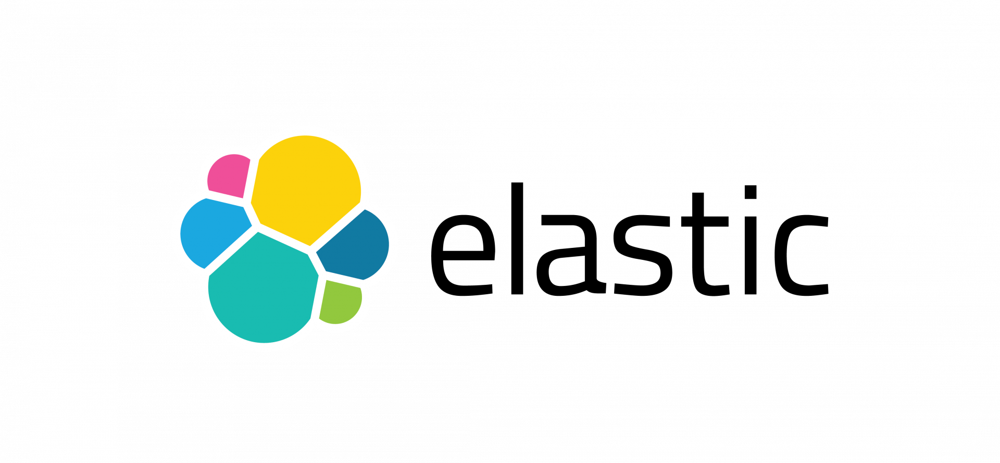

# Advanced Data Bases

**Author:** Davide Antonino Giorgio - s291477  
**Professors:** [Elena Baralis](https://dbdmg.polito.it/wordpress/people/elena-baralis/), [Daniele Apiletti](https://dbdmg.polito.it/wordpress/people/daniele-apiletti/), [Eliana Pastor](https://smartdata.polito.it/members/eliana-pastor/), [Moreno La Quatra](https://smartdata.polito.it/members/moreno-la-quatra/)  
**Year:** 2020-2021

This repository contains the course material related to the projects for the course [Advanced Data Bases](https://didattica.polito.it/pls/portal30/gap.pkg_guide.viewGap?p_cod_ins=01VFVTJ&p_a_acc=2021&p_header=S&p_lang=IT) of "[2nd level Specializing Master, AI, ML and Cloud Computing](https://didattica.polito.it/master/ai_cloud/2021/at_a_glance)" at [Politecnico di Torino](https://www.polito.it/) - 2021.

The course concerns the study of databases in all their forms, with particular reference to the more advanced ones, such as NoSQL DBs.

The course also deals with Disaster Recovery and Replication techniques, as well as migration methods from one engine to another.

The course involved the drafting of three different projects with themes such as: [Data Warehouse](https://www.oracle.com/uk/database/what-is-a-data-warehouse/), [MongoDB](https://www.mongodb.com/) and [Elasticsearch](https://www.elastic.co/).

You can find the reports and the assets directly on the folders:

- [Data Warehouse](https://github.com/DavideAG/AdvancedDataBases/blob/main/1%20-%20Data%20Warehousing/Report_DataWarehousing.pdf)
- [MongoDB](https://github.com/DavideAG/AdvancedDataBases/blob/main/2%20-%20MongoDB/Report_MongoDB.pdf)
- [Elasticsearch](https://github.com/DavideAG/AdvancedDataBases/blob/main/3%20-%20Elasticsearch/Report_Elasticsearch.pdf)

For more information you can contact me at [davide@giorgiodavide.it](mailto:davide@giorgiodavide.it?subject=[GitHub]%20Advanced%20Data%20Bases%20-%20question)

